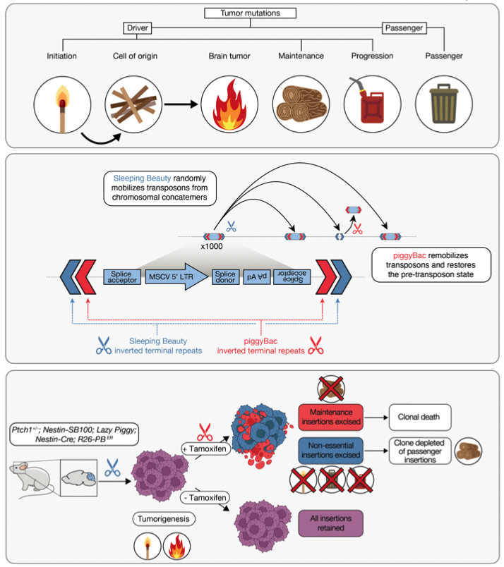

# Lazy Piggy: a double-jumping transposon to identify medulloblastoma maintenance genes.

This repo is for sharing code and processed input data used in preparation of the Lazy Piggy / KCNB2 manuscript, published here: [10.1016/j.devcel.2025.01.001](https://www.cell.com/developmental-cell/abstract/S1534-5807(25)00001-2?rss=yes).

## Show me the code
• All code is stored in [src/scripts](./src/scripts).

• All processed input data is stored in [for_reviewers](./for_reviewers).

## Schematic

## License
This project is licensed under the MIT license. Please see the LICENSE file in the repository for more information.

## Acknowledgements
Much of the original gCIS code for this project was written by Patryk Skowron, later modified and appended by me.
The bulk of the wet-lab work was completed by Jerry Fan, Kevin Wang, and Julia Carrillo Garcia, with supervision from Michael D. Taylor and Xi Huang.
Massive thanks to everyone else involved.

## Contact
Questions? Comments? You can reach me at anders dot erickson at mail dot utoronto dot ca.